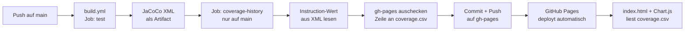

# Design: Coverage Time-Series auf GitHub Pages

Auftrag 2, Teil 3.1 · Stand: 16.09.2026 · Repository: <https://github.com/Flashbibi/450-tictactest-mvk>

Dieses Dokument beschreibt den Entwurf, noch keine Implementation. Grundlage ist der Stand nach Auftrag 1: JaCoCo erzeugt bei jedem Testlauf einen HTML- und einen XML-Report, beide werden als Artifact `jacoco-report` gespeichert.

## Die sieben Fragen

### 1. Woher kommt der aktuelle Coverage-Wert?

Aus dem JaCoCo-XML-Report `build/reports/jacoco/test/jacocoTestReport.xml`, den Auftrag 1 bereits erzeugt. Am Ende der Datei stehen die Gesamtzähler des Projekts:

```xml
<counter type="INSTRUCTION" missed="204" covered="171"/>
<counter type="BRANCH" missed="36" covered="42"/>
<counter type="LINE" missed="42" covered="3"/>
```

Der Prozentwert ist `covered / (covered + missed) × 100`, gerundet auf eine Dezimalstelle. Ein kleines Shell-Skript im Workflow liest die Zeile aus – keine zusätzliche Action nötig.

### 2. Welche Metrik?

**Instruction Coverage.** Der Wert ist JaCoCos feinste Granularität und wird nicht durch die Formatierung des Quellcodes verzerrt.

Line Coverage wäre bei diesem Projekt irreführend: `isWin` ist ein einziges `return` über acht Quellzeilen, JaCoCo zählt das als eine Zeile. Aktuell stehen 45 % Instruction gegen 7 % Line – die 7 % sagen nichts über die Tests aus.

Branch Coverage (aktuell 53 %) wäre als zweite Metrik interessant. Im ersten Schritt speichern wir nur Instruction, das Format lässt eine weitere Spalte aber jederzeit zu.

### 3. Wo und in welchem Format werden historische Daten gespeichert?

Als CSV in einem eigenen Branch `gh-pages`, der gleichzeitig die Quelle für GitHub Pages ist:

```
Datum,Commit,Coverage
2026-09-16,d689b9d,45.6
2026-09-17,a1b2c3d,52.0
```

Ein Datenpunkt pro Commit auf `main`. Warum dieser Ort:

- Die Historie liegt in Git und ist damit selbst versioniert – jede Zeile hat ihren eigenen Commit auf `gh-pages`.
- Daten und Visualisierung liegen im selben Branch, GitHub Pages liefert beides direkt aus.
- `main` bleibt unberührt. Würde die CSV auf `main` liegen, löste jeder Messwert einen neuen Push und damit einen neuen CI-Lauf aus.

CSV statt JSON, weil `echo "..." >> coverage.csv` reicht. Bei JSON müsste ein Array geparst und neu geschrieben werden.

### 4. Wie werden neue Messwerte angehängt?

Ein zusätzlicher Job `coverage-history` in `build.yml`:

1. läuft nur auf `main` (`if: github.ref == 'refs/heads/main'`) und erst nach erfolgreichem `test`-Job (`needs: test`)
2. lädt das Artifact `jacoco-report` aus demselben Lauf herunter – kein zweiter Testlauf
3. liest den Instruction-Wert aus dem XML
4. checkt `gh-pages` in ein Unterverzeichnis aus
5. hängt `Datum,Commit,Coverage` an `coverage.csv` an – nur, wenn der Commit-SHA noch nicht vorkommt, damit ein wiederholter Lauf keine doppelte Zeile erzeugt
6. committet und pusht mit `secrets.GITHUB_TOKEN` (`permissions: contents: write`)

Schlagen die Tests auf `main` fehl, entsteht kein Datenpunkt. Das ist gewollt: eine Coverage ohne grüne Tests ist keine Aussage.

### 5. Wie entsteht daraus eine Time-Series?

Eine statische `index.html` auf `gh-pages` lädt `coverage.csv` per `fetch()` und zeichnet mit Chart.js ein Liniendiagramm: x-Achse Datum, y-Achse Coverage in Prozent, Tooltip mit Commit-SHA.

Die CSV bleibt die einzige Wahrheit. Die Seite muss nie neu gebaut werden, sie liest beim Öffnen die aktuellen Daten. Kein Build-Schritt, keine generierten Bilder.

### 6. Wie wird auf GitHub Pages veröffentlicht?

Repository-Einstellungen → *Pages* → Source: **Deploy from a branch** → `gh-pages`, Verzeichnis `/ (root)`.

Danach deployt GitHub den Branch bei jedem Push automatisch. Die Seite ist unter <https://flashbibi.github.io/450-tictactest-mvk/> erreichbar. Kein `actions/deploy-pages`, keine zusätzliche Action – der Branch ist die Seite.

### 7. Wann wird die Seite aktualisiert?

Bei jedem Push auf `main`, sobald die Tests grün sind. Feature-Branches erzeugen keine Datenpunkte – die Time-Series soll die Entwicklung von `main` zeigen, nicht jeden Zwischenstand.

Der Job wird zusätzlich per `workflow_dispatch` manuell auslösbar, um einen fehlenden Punkt nachzutragen.

## Architektur



Zwei Branches, klar getrennt:

| Branch | Enthält | Wer schreibt |
|---|---|---|
| `main` | Code, Tests, Workflows | Entwickler via PR |
| `gh-pages` | `coverage.csv`, `index.html` | nur der Workflow |

## Ausblick auf Auftrag 3

Das Coverage Gate braucht den Wert von `main`. Mit diesem Design steht er als letzte Zeile in `coverage.csv` – der Gate-Workflow kann ihn von dort lesen, statt `main` ein zweites Mal auszuchecken und zu testen. Beide Aufträge teilen sich damit eine Datenquelle.

## Betrachtete Alternativen

**ReportGenerator** (danielpalme) kann selbst Historien-Diagramme erzeugen. Verworfen, weil das Tool .NET braucht und ein komplettes Report-Framework mitbringt, während wir nur eine Zahl pro Commit festhalten.

**`actions/deploy-pages`** mit Artifact statt `gh-pages`-Branch. Verworfen, weil das Artifact bei jedem Lauf neu entsteht – die Historie müsste dann zuerst vom vorherigen Deployment heruntergeladen werden. Der Branch hält die Historie von selbst.

**CSV auf `main`** statt auf `gh-pages`. Verworfen, siehe Frage 3: jeder Messwert würde einen CI-Lauf auslösen.

**Metrik Line Coverage.** Verworfen, siehe Frage 2.
