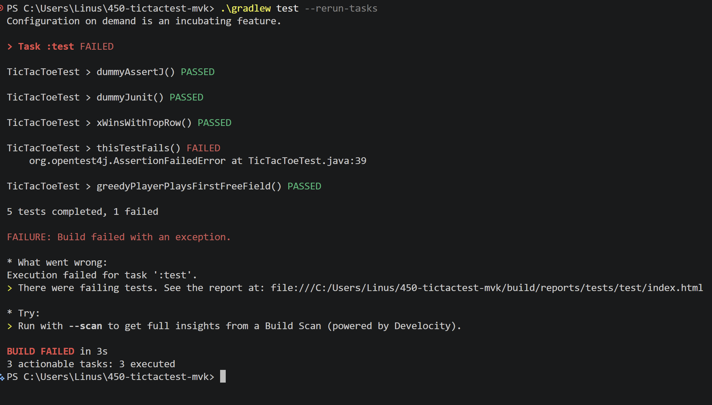

# Testdokumentation – TicTacToe (M450)

## Setup

`build.gradle`:

```groovy
dependencies {
    testImplementation 'org.assertj:assertj-core:3.27.7'
    testImplementation 'org.junit.jupiter:junit-jupiter:6.1.3'
    testRuntimeOnly 'org.junit.platform:junit-platform-launcher'
}

test {
    useJUnitPlatform()
}
```

Ausführen: `./gradlew test`

## Test-Code auf GitHub

<https://github.com/Flashbibi/450-tictactest-mvk/blob/main/src/test/java/ch/bbw/m450/tictactoe/TicTacToeTest.java>

## Tests (GIVEN_WHEN_THEN)

**1. `dummyJunit`** – Dummy-Test für JUnit
- **GIVEN** der Wert `false`
- **WHEN** JUnit ihn mit `assertFalse(false)` prüft
- **THEN** läuft der Test durch – JUnit ist eingebunden

**2. `dummyAssertJ`** – Dummy-Test für AssertJ
- **GIVEN** der Text `"TicTacToe"`
- **WHEN** AssertJ ihn mit `assertThat(text).isNotBlank()` prüft
- **THEN** läuft der Test durch – AssertJ ist eingebunden

**3. `xWinsWithTopRow`**
- **GIVEN** ein Board mit `X X X` in der obersten Zeile
- **WHEN** `TicTacToeMain.isWin(board, CROSS)` aufgerufen wird
- **THEN** ist das Ergebnis `true`

**4. `greedyPlayerPlaysFirstFreeField`**
- **GIVEN** ein Board, auf dem die Felder 0 und 1 belegt sind
- **WHEN** der `GreedyPlayer` seinen Zug wählt
- **THEN** spielt er auf Position `2`, das erste freie Feld

**5. `thisTestFails`** – schlägt absichtlich fehl
- **GIVEN** der Wert `true`
- **WHEN** JUnit mit `assertFalse(true)` prüft, ob er falsch ist
- **THEN** schlägt der Test fehl

## Ergebnis

```
TicTacToeTest > dummyAssertJ() PASSED
TicTacToeTest > dummyJunit() PASSED
TicTacToeTest > xWinsWithTopRow() PASSED
TicTacToeTest > thisTestFails() FAILED
TicTacToeTest > greedyPlayerPlaysFirstFreeField() PASSED

5 tests completed, 1 failed
```

## Screenshot
